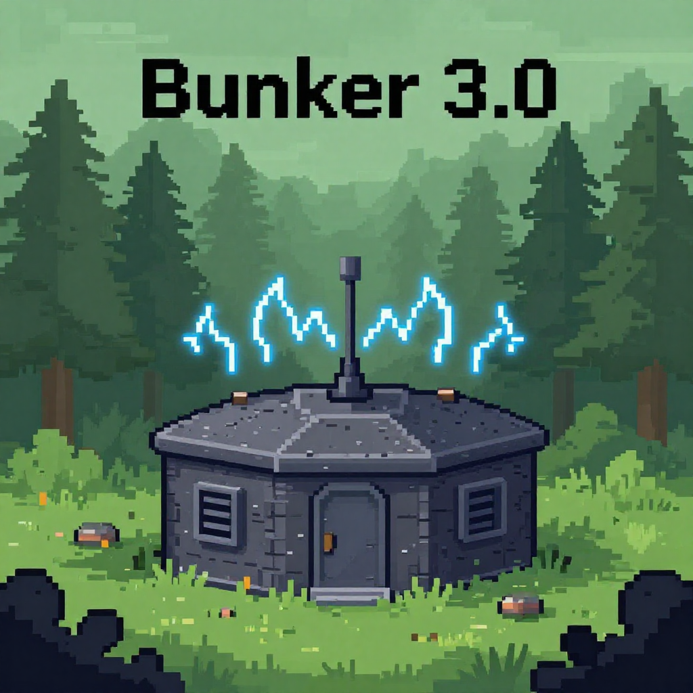

<div align="center">
  
  <h1>🚧 Бункер 🚧</h1>
  <p><strong>Сетевая игра для 4–10 игроков</strong></p>
  <p>
    
    
    
  </p>
</div>

---

## 📖 Описание

**Бункер** - это игра написанная с использованием библиотеки FastAPI для коммуникации игроков между собой. Каждый игрок в начале получает набор характеристик, которые изначально видны только ему. Игра является пошаговой, и каждый раунд, каждый оставшийся игрок должен открыть свою карту характеристики, и рассказать о ней, как и почему она полезна, для того, чтобы прибавить себе шансы на выживание

Игра **кросс-платформенная** (Windows и Linux), поддерживает **локальную сеть** и **ZeroTier/Hamachi/Radmin**.

---

## 🎮 Как играть

### Создание комнаты
1. Нажмите `Создать комнату`.
2. Выберите количество игроков (4–10) и свой номер.
3. Укажите IP-адрес сервера (его вы можете увидеть в приложении которое создало виртуальную локальную сеть).
4. Нажмите `Создать бункер`. Сервер запустится автоматически.

### Подключение к комнате
1. Нажмите `Присоединиться к комнате`.
2. Введите код комнаты (скажет ведущий), свой номер и IP-адрес сервера ведущего.
3. Нажмите `Подключиться`.

### Игровой процесс
- У каждого игрока есть страница со скрытыми для других характеристиками.
- **Только игрок** может открывать свои карты (Чекбоксы у характеристик открывают характеристики для всех).
- Когда в бункере останется нужное количество человек (для 4–5 игроков — 2, для 6 — 3, и т.д.), станет доступна кнопка **«⚡ Угроза»**.
- После нажатия ведущий открывает карту угрозы, если выжившие способны победить угрозу, они побеждают.

---

## 📥 Установка

### 🪟 Windows
1. Скачайте `Bunker_Windows.zip` из раздела [Releases](https://github.com/H0-B0/Bunker/releases).
2. Распакуйте в любую папку.
3. Запустите `Bunker.exe`.

### 🐧 Linux
1. Скачайте `Bunker_Linux_Installer.tar.gz` из раздела [Releases](https://github.com/H0-B0/Bunker/releases).
2. Распакуйте:
   ```bash
   tar -xzvf Bunker_Linux_Installer.tar.gz
   cd Bunker_Linux_Installer
3. Установите:
   ```bash
   chmod +x install.sh
   ./install.sh
   
4. Игра установится в ~/.local/bin, иконка появится на рабочем столе.

💡 Примечание: Если иконка не запускается, проверьте наличие xdg-utils (обычно уже установлен).


🛠️ Системные требования:
<table>
<tr><td>🪟</td><td>Windows 10/11, 1 ГБ ОЗУ, 100 МБ диска</td></tr>
<tr><td>🐧</td><td>Современный дистрибутив (Ubuntu 20.04+, Debian 11+, Fedora 35+), 1 ГБ ОЗУ, 100 МБ диска</td></tr>
</table>
Дополнительное ПО не требуется

🌐 Сетевая игра
<ul>
<li>Локальная сеть: все в одной Wi-Fi/проводной сети. Ведущий раздаёт свой локальный IP (например, 192.168.1.10).

<li>ZeroTier / Hamachi: используйте для игры через интернет. У всех должен быть виртуальный IP из одной сети.
</ul>

🧪 Сборка из исходников (для разработчиков)
  ```bash
  git clone https://github.com/H0-B0/Bunker.git
  cd Bunker
  pip install -r requirements.txt
  python main.py
  ```


## 📄 Лицензия

Проект распространяется под лицензией MIT. Вы можете свободно использовать, изменять и распространять код. Если вы используете его в своём проекте, я буду признателен, если вы сообщите мне об этом (например, через Issues или email). Спасибо!

<<Данный проект является неофициальной, некоммерческой, учебной реализацией механики настольной игры "Бункер" и не связан с её правообладателями. Проект не претендует на прибыль, все права на игру принадлежат её законным владельцам и вообще я за ЗОЖ и т.д.>>
